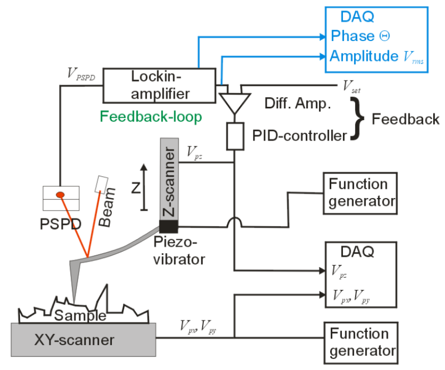
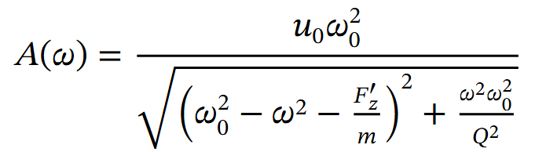
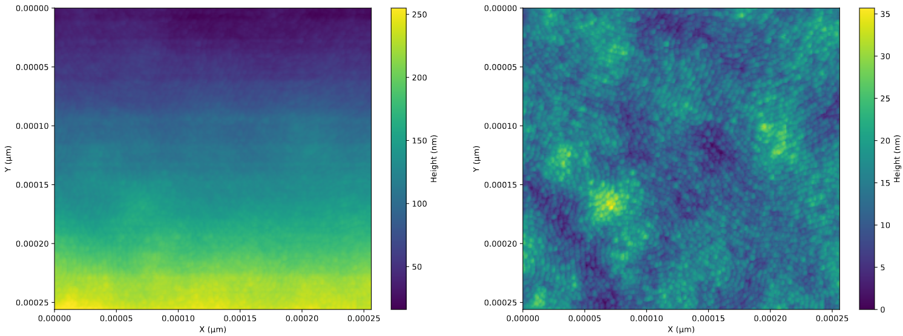
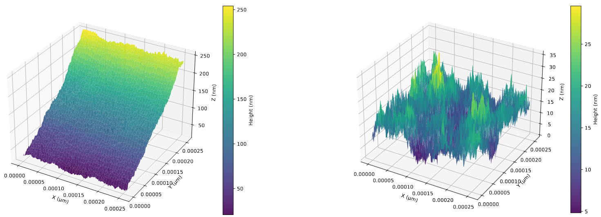
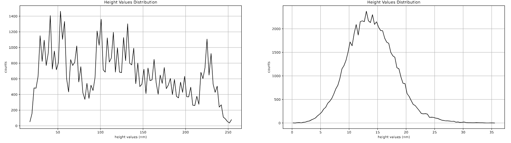
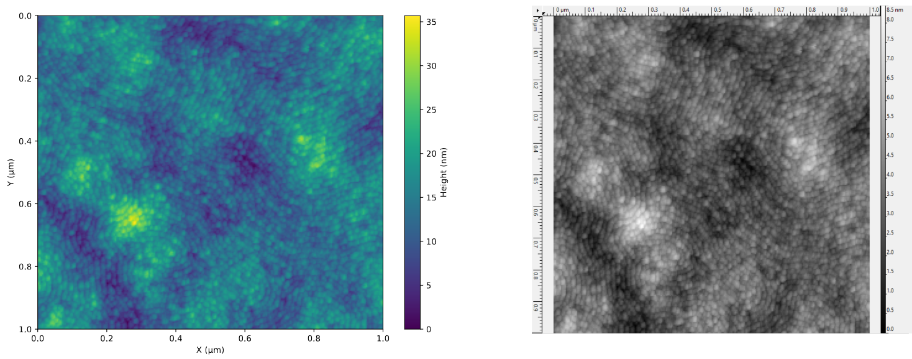
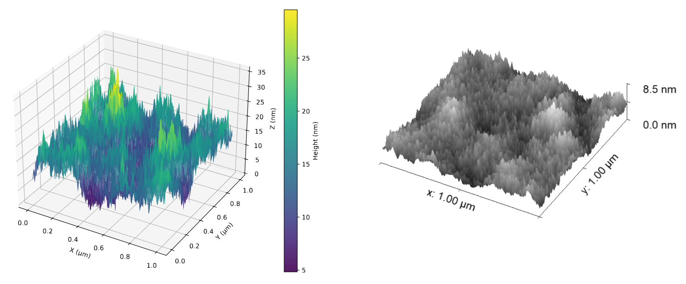
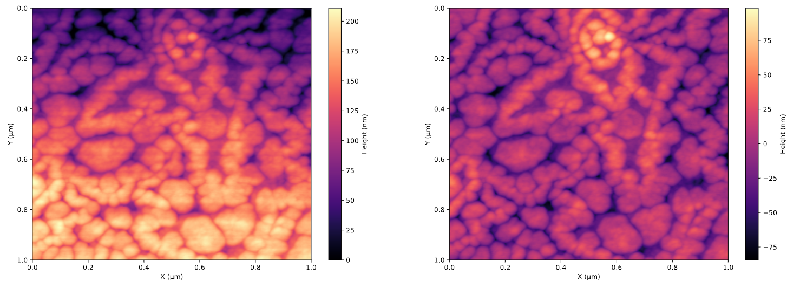
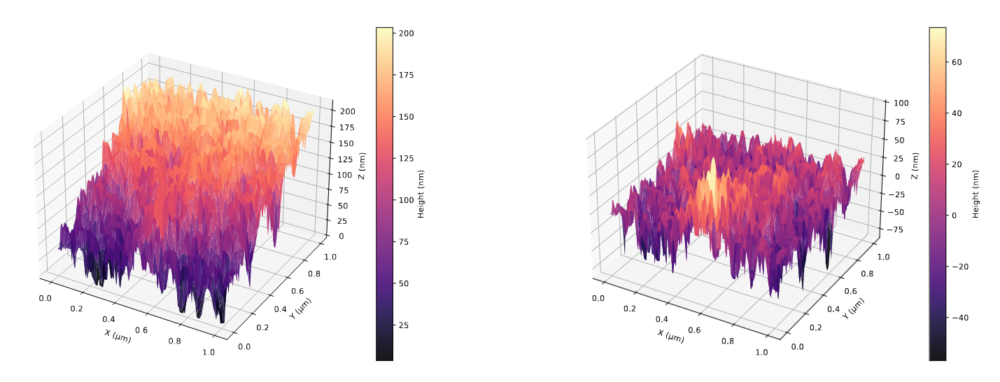
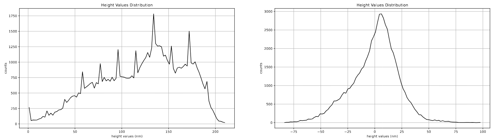

# AFM_analisys
This project provides a set of tools and functions to perform the image correction and the analysis of the topological data produced by an atomic force microscope (AFM).

## Introduction
The atomic force microscope, if used for a topological surface analysis, is an experimental device that exploits the Van Der Waals interaction between a tip connected to a cantilever and the sample to detect its surface structure. A function generator applies an AC potential to a piezo-vibrator made of a piezoelectric material, which moves the cantilever at the selected oscillation frequency and amplitude. A laser pointing to the cantilever projects its deflection to a photodiode which produces an electric signal that enters into a lock-in amplifier, which removes all the frequencies different from the one of the function generator. The amplifier produces as output a DC signal equal to the root mean squared of the input signal at the reference frequency, which is compared to a set point voltage through a differential amplifier, which amplifies the difference between the two. If this difference is non-zero, it will activate a PID feedback system that adjusts the distance between the sample and the tip, in order to reach the set point condition.



The behavior of the cantilever oscillation amplitude A with respect to the oscillation frequency is described by the following equation:



which is the well known force damped oscillator model. In the case of a perfectly flat surface, the output voltage produced from the lock-in amplifier equals the set point voltage, determining a certain oscillation amplitude of the cantilever. If the distance between the tip and the sample changes due to some surface morphology, the Van Der Waals force between them also changes and so does its first derivative. As a result the amplitude vs frequency curve gets shifted and the cantilever oscillation amplitude changes, while the oscillation frequency remains unchanged. In this way, the lock-in amplifier produces a different output voltage from the set point one, so the PID system activates adjusting the distance between the tip and the cantilever in order to re-shift back the amplitude vs frequency curve such that the cantilever oscillation amplitude corresponds to the set point voltage. The potential applied to change the sample-tip distance determines the height of the sample surface in that coordinate.

## Repository Structure

This section explains the repository structure. For a greater detail on each instance of the modules inside *afm_analysis*, you can check the [📚 code documentation](docs/code_documentation/index.html) and you can open it by following the [opening the documentation](#opening-the-documentation) tutorial.

The repository structure is the following:

```
AFM_analysis/
├── README.md
├── afm_analysis/
│   ├── __init__.py
│   ├── image_correction/
│   │   ├── __init__.py
│   │   ├── image_correction_functions.py
│   │   └── image_correction_pipeline.py
│   ├── data_analysis/
│   │   ├── __init__.py
│   │   ├── data_analysis_functions.py
│   │   └── data_analysis_pipeline.py
│   ├── run_afm_analysis.py
│   ├── graphics.py
│   └── smart_file.py
├── docs/
│   ├── code_documentation/
│   │   ├── afm_analysis/
│   │   │   ├── image_correction/
│   │   │   │   ├── image_correction_functions.html
│   │   │   │   └── image_correction_pipeline.html
│   │   │   ├── data_analysis/
│   │   │   │   ├── data_analysis_functions.html
│   │   │   │   └── data_analysis_pipeline.html
│   │   │   ├── image_correction.html
│   │   │   ├── data_analysis.html
│   │   │   ├── graphics.html
│   │   │   ├── run_afm_analysis.html
│   │   │   └── smart_file.html
│   │   ├── afm_analysis.html
│   │   ├── index.html
│   │   └── search.js
│   ├── images/
│   │   ├── 2d_comparison_with_gw.png
│   │   ├── 2d_example_comparison.png
│   │   ├── 2d_example_pn_junc.png
│   │   ├── 3d_comparison_with_gw.png
│   │   ├── 3d_example_comparison.png
│   │   ├── 3d_example_pn_junc.png
│   │   ├── afm_structure.png
│   │   ├── amplitude_vs_frequency.png
│   │   ├── height_dist_comp_pn_junc.png
│   │   └── height_dist_comparison.png
│   └── input_file_examples/
│       ├── mesoporous_SiO2.tiff
│       └── pn_junction.tiff
├── input_files/
├── output_files/
├── requirements.txt
├── settings.json
└── tests/
    ├── __init__.py
    ├── testing_data_analysis.py
    ├── testing_image_correction.py
    └── testing_pipeline.py
```
-  ***afm_analysis/*** is the main package, containing the functions and classes that perform the image subtraction and the data analysis, along with the data reading and visualization:

    - ***image_correction/***  is a package that contains the functions that perform the image correction. *image_correction_functions.py* is the module that contains all the functions related to the mathematical operations and corrections that are performed, while *data_analysis_pipeline.py* contains a single function that manages the execution pipeline of those functions based on the *settings.json* file and raises the exceptions.

    - ***data_analysis/*** is a package that contains the functions that perform the data analysis of the image. *data_analysis_functions.py* is the module that contains all the functions related to the statistical and mathematical operations that are performed, while *data_analysis_pipeline.py* contains a single function that manages the execution pipeline of those functions based on the *settings.json* file and raises the exceptions. The data analysis functions need to be executed after performing the image correction, to ensure correct results.

    - ***run_afm_analysis.py*** is the script that manages the execution af all the functions. First of all, it reads the .tiff input file from the *input_files/* folder and enables the results file writing if specified by the execution command (see step 3. of the [tutorial on how to run the analysis](#running-the-analysis) for greater detail). Than it executes the functions in the pipelines for both image correction and data analysis. Finally it generates the output images inside the *output_files/* folder.

    - ***graphics.py*** is the module that contains the functions to manage the .tiff file reading from the *input_files/* folder. It also has the functions that generate and save the output images and the plots inside the *output_files/* folder.

    - ***smart_file.py*** contains the definition of the class *SmartFile*, which is a file-like object that is characterized by an `enabled` internal state. If `enabled = True`, the file object is created and the writing is allowed, if `enabled = False`, the file is not created and it is not possible to write on it. This class is used to create the *results.txt* file only if the user asks to (see ... for greater detail) and thus symplifies the functions inside *image_correction/* and *data_analysis/* that do not need to check for this user-set condition.

- ***docs/*** is the folder that contains the images and files related to the documentation.

   - ***code_documentation*** contains the documentation of the functions inside the *afm_analysis* package in .html format. See the [opening the documentation](#opening-the-documentation) tutorial to get details on how to open these files.

   - ***images/*** contains images regarding the AFM behavior and examples for the documentation.

   - ***input_file_examples/*** contains some input .tiff files that can be used to try this software.

- ***input_files/*** is the folder where the .tiff file that will be analysed needs to be placed. The file name needs to contain the .tiff extension in order to be correctly found, otherwise an exception will rise.

- ***output_files/*** is the folder where the output images and the data analysis results will be saved.

- ***settings.json*** is the file that contains the options for each image correction and data analysis action that can be performed. The user can modify this file in order to select the preferred correction and analysis to be performed. See step 2. of the [tutorial on how to run the analysis](#running-the-analysis) section for greater detail on the possible keywords and options that can be selected by the user.

- ***tests/*** is the folder that contains all the tests. See the [tutorial on how to run the tests](#running-the-tests) for greater detail on how to execute the tests.

   - ***testing_image_correction.py*** tests the functions inside the *image_correction/image_correction_functions.py* module.

   - ***testing_data_analysis.py*** tests the functions inside the *data_analysis/data_analysis_functions.py* module.

   - ***testing_pipeline.py*** tests that the modules *image_correction/image_correction_pipeline.py* and *data_analysis/data_analysis_pipeline.py* work properly and build the correct function pipelines.


## Getting Started

This program is tested working in the python 3.10 version.

1. Clone the repository by typing on the terminal the following command
```
git clone https://github.com/Rotore02/AFM_analysis.git
```
If the repository has been correctly cloned in your current path location, a folder *AFM_analysis* should appear when executing
```
ls
```
in the terminal.

2. Move to the *AFM_analysis* folder using
```
cd AFM_analysis
``` 
and install the required dependencies by executing
```
pip install -r requirements.txt
```

3. A text editor is necessary to modify and save the file *settings.json*. In case you don't have one, you can install nano on your linux distribution. If you are using Debian or Ubuntu, you can execute
```
sudo apt install nano
```
if you are using Fedora
```
sudo dnf install nano
```
or if you are using Arch Linux
```
sudo pacman -S nano
```

4. A web browser is needed in order to open the code documentation in the folder *docs/code_documentation/*. In case you don't have one, you can install the snap firefox on Ubuntu with the following command
```
sudo snap install firefox
```

## Tutorial

This tutorial explains how to start the program and obtain the desired results assuming that the repository has been correctly cloned and the dependencies have been installed, as well as the text editor. If this is not the case, go check the [Getting Started](#getting-started) section.

### Running the Analysis

In this tutorial we perform the analysis of the *mesoporous_SiO2.tiff* file, which is present in the folder *docs/input_file_examples/*.

1. Place yourself in the *AFM_analysis* folder and move the *mesoporous_SiO2.tiff* file from the *docs/input_file_examples/* folder to the *input_files/* one by executing
```
cp docs/tutorials/nomefile.tiff input_files/
```
and verify that it has correctly been copied by using
```
ls input_files/
```
Every file that needs to be analysed must be placed in the *input_files/* directory, so if you are using your own AFM data, make sure to place them in this directory. 

2. Now you can open and modify the *settings.json* file with your text editor. In case you are using nano, you can execute
```
nano settings.json
```
and modify the file direcly from the terminal. The keywords in this file are based on the kind of correction and analyses that you want to perform. The following is the *settings.json* file and the comments are the possible options (note that .json files do not support comments, so remember to delete them if you copy and paste this file).

```
{
    "files_specifications": {
        "input_file_name": "mesoporous_SiO2.tiff",
        "2D_image_output_file_name": "mesoporous_SiO2_output_2D.pdf",
        "3D_image_output_file_name": "mesoporous_SiO2_output_3D.pdf",
        "scanning_rate": 256,
        "image_length": 1,
        "height_scaling_factor": 1
    },

    "image_correction": {
        "common_plane_subtraction": "yes",    # yes / no
        "line_drift_correction": "linear",    # linear / mean
        "data_shift": "minimum"               # minimum / mean
    },

    "data_analysis": {
        "height_values_distribution": "yes",  # yes / no
        "roughness": "1d"                     # 1d / 2d / no
    },

    "graphics": {
        "color_map": "viridis"                # options listed in [1]
    }
}
```
The *scanning_rate* and the *image_length* are known from the experimental setup, while *height_scaling_factor* is known from the experimental device and acquisition software (check [3] for greater detail). Of course, the *input_file_name* must be the name of a .tiff file in the *input_files/* directory. As a reference to check the exact behavior of the functions involved for the selected keywords, you can open the [📚 code documentation](docs/code_documentation/index.html) by using the [opening the documentation](#opening-the-documentation) tutorial. Remember to save your changes before exiting the editor.

3. Now you are ready to run the analysis by executing one of these commands from the *AFM_analysis/* folder:
   - ```python3 -m afm_analysis.run_afm_analysis``` to run the analysis without generating any .txt results file.
   - ```python3 -m afm_analysis.run_afm_analysis --results``` run the analysis and generate a .txt results with default name *results.txt*.
   - ```python3 -m afm_analysis.run_afm_analysis --results filename.txt``` run the analysis and generate a .txt results with name *filename.txt*.

4. You can check the generated results in the *output_files/* folder, which should be equal to the ones presented in the [mesoporous silicon oxide](#mesoporous-silicon-oxide-sio2) example.

### Running the Tests 

1. Place yourself in the *tests/* folder. If you are in the *AFM_analysis/* one, you can do
```
cd tests
```
in the terminal.

2. You can run each test module with pytest by executing one of these commands from the *tests/* folder:
   - ```pytest testing_image_correction.py``` to run the tests for the image correction functions inside the *image_correction_functions.py* module.
   - ```pytest testing_data_analysis.py``` to run the tests for the data analysis functions inside the *data_analysis_functions.py* module.
   - ```pytest testing_pipeline.py``` to run the tests to ensure the correctness of the function pipelines built by the *build_image_correction_pipeline.py* and *build_data_analysis_pipeline.py* module.

### Opening the Documentation

To open the documentation you just need to run the command
```
xdg-open relative/path/to/index.html
```
to open the .html documentation file with your default browser. If you are for example in the *AFM_analysis/* folder, you need to execute
```
xdg-open docs/code_documentation/index.html
```
or, if you installed snap firefox following the instructions on point 4. in the [getting started](#getting-started) section, you can also execute
```
firefox docs/code_documentation/index.html
```
## Examples

### Mesoporous Silicon Oxide (SiO2)
The following example shows the image correction results and the data analysis of a surface of mesoporous silicon oxide (See the [tutorial on how to run the analysis](#running-the-analysis) to go through how these specific results have been obtained). The *settings.json* file used to perform this analysis is the following:

```
{
    "files_specifications": {
        "input_file_name": "mesoporous_SiO2.tiff",
        "2D_image_output_file_name": "mesoporous_SiO2_output_2D.pdf",
        "3D_image_output_file_name": "mesoporous_SiO2_output_3D.pdf",
        "scanning_rate": 256,
        "image_length": 1
        "height_scaling_factor": 1
    },

    "image_correction": {
        "common_plane_subtraction": "yes",
        "line_drift_correction": "linear",
        "data_shift": "minimum"
    },

    "data_analysis": {
        "height_values_distribution": "yes",
        "roughness": "1d"
    },

    "graphics": {
        "color_map": "viridis"
    }
}
```
The following images represent the data produced directly by the AFM (left) and after the correction with this program with this settings:




The height distribution of the non-corrected (left) and corrected images is also generated:



The generated results file is the following:

```
COMMON PLANE SUBTRACTION
plane equation: z = a*x + b*y + c
a = 0.007002397652048833
b = 0.8396678572689857
c = 12.476285051279024
----------------------------

LINE DRIFT SUBTRACTION
line equation: z = m*z + q
average m value = -1.0259805158230328e-15
m values standard deviation = 0.02507257771218171
average q value = 1.3211653993039363e-13
q values standard deviation = 9.364454760442339
----------------------------

1D ROUGHNESS
roughness = 4.146539713799436 nm
standard deviation = 0.8500021157680003 nm
----------------------------
```

We can compare the images obtained with this software (left) with the ones generated from *Gwyddion* [2] (right), a commonly used software for AFM data analysis and image correction:





The heights scales are different, since the values stored in the .tiff file depend on the specific instrument and acquisition software and must be known ad priori (see [3] for greater detail).

### Organic pn Junction

The following example shows the image correction results and the data analysis of a surface of an organic pn junction. The *settings.json* file used to perform this analysis is the following:

```
{
    "files_specifications": {
        "input_file_name": "pn_junction.tiff",
        "2D_image_output_file_name": "pn_junction_output_2D.pdf",
        "3D_image_output_file_name": "pn_junction_output_3D.pdf",
        "scanning_rate": 256,
        "image_length": 1,
        "height_scaling_factor": 1
    },

    "image_correction": {
        "common_plane_subtraction": "yes",
        "line_drift_correction": "mean",
        "data_shift": "mean"
    },

    "data_analysis": {
        "height_values_distribution": "yes",
        "roughness": "2d"
    },

    "graphics": {
        "color_map": "magma"
    }
}
```
The following images represent the data produced directly by the AFM (left) and after the correction with this program with this settings:




The height distribution of the non-corrected (left) and corrected images is also generated:



The generated results file is the following:

```
COMMON PLANE SUBTRACTION
plane equation: z = a*x + b*y + c
a = -0.029906002785959514
b = 0.5211801827103912
c = 58.03533258697865
----------------------------

MEAN DRIFT SUBTRACTION
average mean value = 5.812017533912694e-14
standard deviation = 9.364956513407211
----------------------------

2D ROUGHNESS
roughness = 21.657787749953247 nm
----------------------------
```

## References

[1] https://matplotlib.org/stable/users/explain/colors/colormaps.html <br>
[2] David Nečas, Petr Klapetek, Gwyddion: an open-source software for SPM data analysis, Cent. Eur. J. Phys. 10(1) (2012) 181-188. Gwyddion documentation url: https://gwyddion.net/. <br>
[3] https://gwyddion.net/documentation/user-guide-en/specific-data-import.html