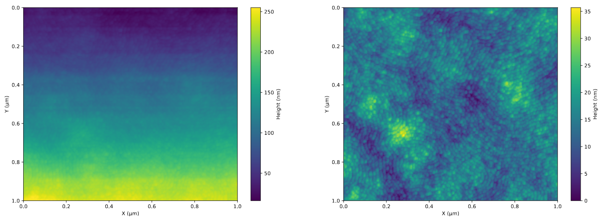

# AFM_analisys
This project provides a set of tools and functions to perform the image correction and the analysis of the topological data produced by an atomic force microscope (AFM).

## Introduction
The atomic force microscope, if used for a topological surface analysis, is an experimental device that exploits the Van Der Waals interaction between a tip connected to a cantilever and the sample to detect its surface structure. A function generator applies an AC potential to a piezo-vibrator made of a piezoelectric material, which moves the cantilever at the selected oscillation frequency and amplitude. A laser pointing to the cantilever projects its deflection to a photodiode which produces an electric signal that enters into a lock-in amplifier, which removes all the frequencies different from the one of the function generator. The amplifier produces as output a DC signal equal to the root mean squared of the input signal at the reference frequency, which is compared to a set point voltage through a differential amplifier, which amplifies the difference between the two. If this difference is non-zero, it will activate a PID feedback system that adjusts the distance between the sample and the tip, in order to reach the set point condition.


The behavior of the cantilever oscillation amplitude A with respect to the oscillation frequency is described by the following equation:


which is the well known force damped oscillator model. In the case of a perfectly flat surface, the output voltage produced from the lock-in amplifier equals the set point voltage, determining a certain oscillation amplitude of the cantilever. If the distance between the tip and the sample changes due to some surface morphology, the Van Der Waals force between them also changes and so does its first derivative. As a result the amplitude vs frequency curve gets shifted and the cantilever oscillation amplitude changes, while the oscillation frequency remains unchanged. In this way, the lock-in amplifier produces a different output voltage from the set point one, so the PID system activates adjusting the distance between the tip and the cantilever in order to re-shift back the amplitude vs frequency curve such that the cantilever oscillation amplitude corresponds to the set point voltage. The potential applied to change the sample-tip distance determines the height of the sample surface in that coordinate.

## Repository Structure
```
AFM_analysis/
├── README.md
├── afm_analysis/
│   ├── __init__.py
│   ├── data_analysis/
│   │   ├── __init__.py
│   │   ├── data_analysis_functions.py
│   │   └── data_analysis_pipeline.py
│   ├── image_correction/
│   │   ├── __init__.py
│   │   ├── image_correction_functions.py
│   │   └── image_correction_pipeline.py
│   ├── run_afm_analysis.py
│   ├── graphics.py
│   └── smart_file.py
├── docs/
│   └── images/
│       ├── afm_structure.png
│       └── amplitude_vs_frequency.png
├── input_files/
├── output_files/
├── settings.json
├── tests
│   ├── __init__.py
│   ├── testing_data_analysis.py
│   ├── testing_image_correction.py
│   └── testing_pipeline.py
└── requirements.txt
```
## Installation and Execution

## Examples
The following example shows the images corresponding to the data produced directly by the AFM (left) and after the correction with this program for a surface of **mesoporous silicon oxide (SiO2)**:




The height distribution of the non-corrected (left) and corrected images can also be generated:


## References
[1]